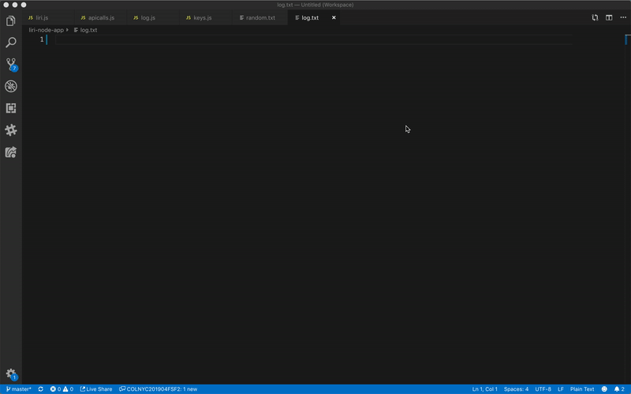
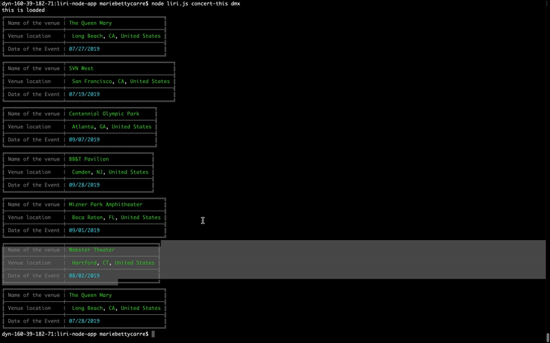
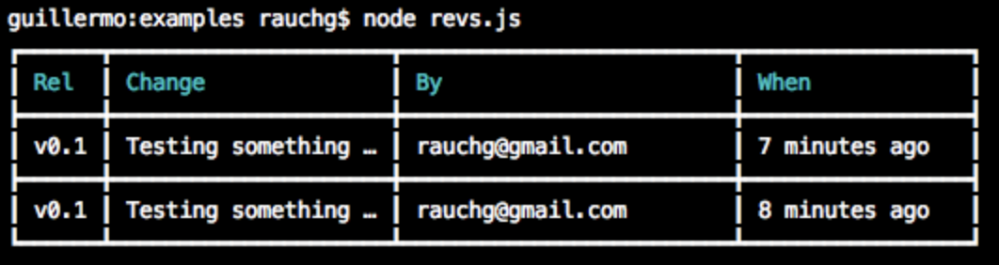
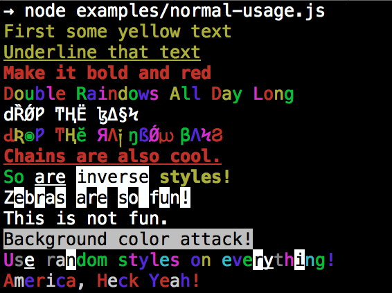

# liri-node-app
#### A simple app that you can pass command (*As if passing a question) to to get a response from one of three diffenrent api which are Spotify API for songs, Bands in Town API for concerts, and OMDB API for movies.. Which would be done through Node with liri in the command line that will take two parameters.





# Tools needed for the APP

## - Node Spotify API 🚀 🎶
A simple to use API library for the Spotify REST API.
https://www.npmjs.com/package/node-spotify-api

## - axios
Promise based HTTP client for the browser and node.js.
https://www.npmjs.com/package/axios

## - moment
A lightweight JavaScript date library for parsing, validating, manipulating, and formatting dates.
https://www.npmjs.com/package/moment

## - dotenv
Dotenv is a zero-dependency module that loads environment variables from a .env file into process.env. Storing configuration in the environment separate from code is based on The Twelve-Factor App methodology.
https://www.npmjs.com/package/dotenv

## - CLI Table
This utility allows you to render unicode-aided tables on the command line from your node.js scripts.
https://www.npmjs.com/package/cli-table



## - colors
get color and style in your node.js console
https://www.npmjs.com/package/colors


# -Instruction 

## 1 - clone the repo

## 2 - run `npm install` 

## 3 - Make a JavaScript file named keys.js. although it isnt required. It's a good way to store keys in private file such as a .env file.
  * Inside keys.js your file will look like this
``` exports.THEAPI = {
        id: process.env.THEAPI_ID,
        secret: process.env.THE API_SECRET
    };
```

## 4 - create a file named .env, add the following to it, replacing the values with your API keys (no quotes) once you have them
``` THE API keys

THEAPI_ID=your-API-id
THEAPI_SECRET=your-API-secret
```
   * This file will be used by the `dotenv` package to set what are known as environment variables to the global `process.env` object in node. These are values that are meant to be specific to the computer that node is running on, and since we are gitignoring this file, they won't be pushed to github — keeping our API key information private.

   * If someone wanted to clone your app from github and run it themselves, they would need to supply their own `.env` file for it to work.

## 5 - Make a file called random.txt
### * Inside of random.txt put the following in with no extra characters or white space:
   * spotify-this-song,"I Want it That Way"
   

    


